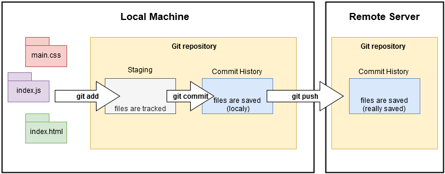

# Learning Git

Useful commands that I used when I was learning Git & GitHub. I hope they are also useful to you! :fire:

This is a general structure of the Git workflow.



### Working in the staging area (local)

**Add files**
```
git add file_name
git add .
git add -A
```

**Delete files**
```
git rm --cached file
git rm -r --cached .
```

**View status**
```
git status
```

### Working in the commit history area (local)

**Add files**
```
git commit -m "Message"
```

**View state**
```
git log
```

**View details of one commit**
```
git show commit_id
```

**View differences**
```
git diff
```

**Restore file from the last commit**
```
git restore file_name
```

**Change the message of the last commit**
```
git commit --amend -m "Correct message"
```

### Working in the remote repository

**Add remote repository**
```
git remote add origin http://repo
```

**Download latest changes**
```
git pull
```

**Send a commit to remote repo**
```
git push -u origin branch_name
```

### Working with branches

**View current branch**
```
git branch
```

**View remote branchs**
```
git branch -r
```

**View all branchs**
```
git branch -a
```

**Create a branch as a copy of the actual branch**
```
git branch branch_name
git checkout -n branch_name
```

**Dele a branch locally**
```
git branch -d branch_name
```

**Switch to another branch**
```
git checkout branch_name
```

**Push branch to remote server**
```
git push -u origin branch_name
```

### Working with rebase

Rebase command allows you to pull all commits from master, and then you can apply all of yours commit chganges. 

```
git pull -r origin main
```

If there are conflicts, we need to resolve it: 
```
//modify files with conflic
git add .
git reabase --continue
```
It continues until there is no more conflicts.
After fix all the conflicts, we be able to rebase to remote server.


```
git push -f origin main
```
